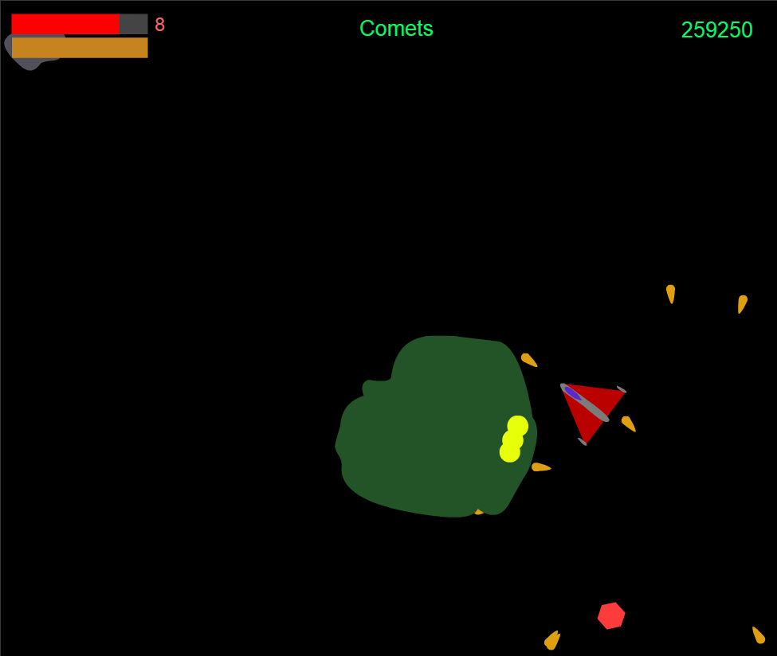

# Astro

A few years ago I only knew ActionScript 2.0 and found moving to 3.0 quite intimidating, so I coded this game to get to grips with it.

Unfortunately I think the corresponding .fla is lost to the void of space.

I still like to play the (mostly finished) game here - http://similarimages.net/daniel/astro/

It is based on a game we used to play in the 90's called [AstroFire](http://www.ortsoftware.com/af.html).

# Screenshots

